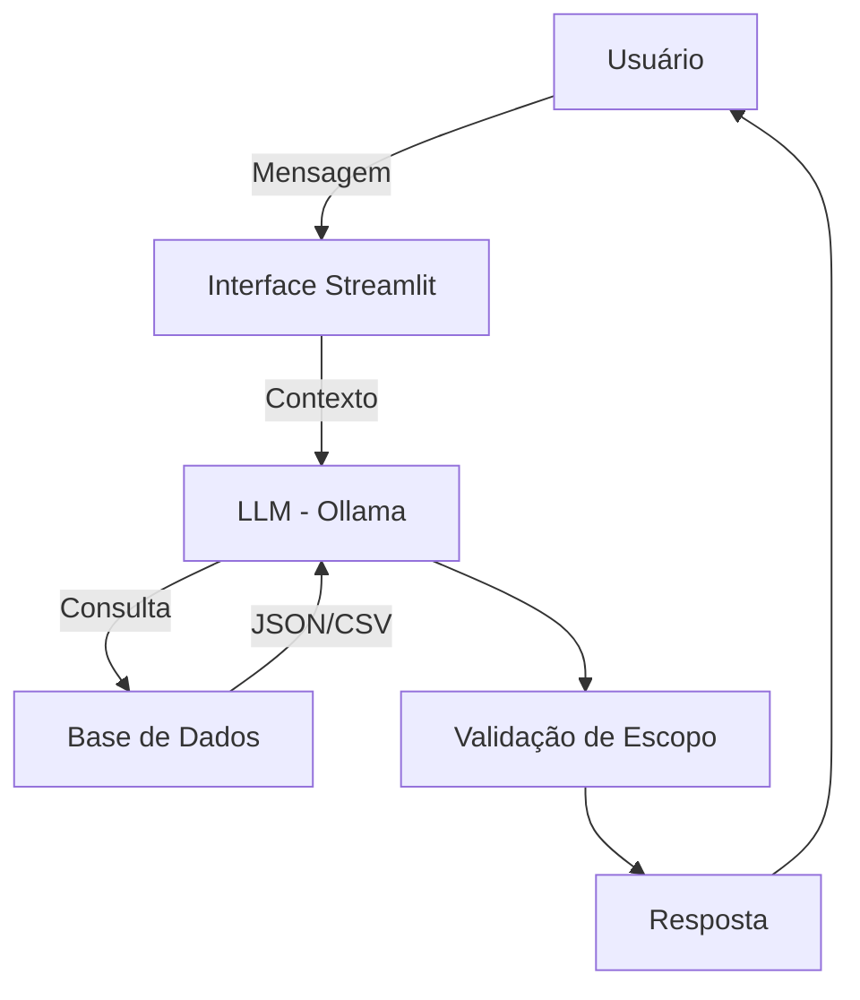

# 🤖 SAM - Smart Assistant for Money Planning

Assistente inteligente de planejamento financeiro desenvolvido com IA Generativa, focado em simulações e organização financeira pessoal.

---

## 📋 Sobre o Projeto

O **SAM** é um agente financeiro inteligente que auxilia usuários na organização de finanças, simulação de cenários e definição de metas financeiras. Diferente de chatbots tradicionais, o SAM atua de forma consultiva, analítica e responsável, sempre baseando suas respostas em dados fornecidos pelo usuário.

### 🎯 Principais Funcionalidades

- **Análise de gastos mensais** por categoria
- **Simulação de cenários** financeiros
- **Acompanhamento de metas** e objetivos
- **Sugestões contextualizadas** baseadas no perfil do usuário
- **Respostas seguras** sem alucinações ou informações inventadas

---

## 🏗️ Arquitetura



### Componentes Principais

- **Interface**: Streamlit
- **LLM**: Ollama (Llama3 - execução local)
- **Base de Conhecimento**: JSON e CSV mockados
- **Validação**: Regras de escopo e consistência financeira

---

## 📂 Estrutura do Projeto

```
📁 lab-agente-financeiro/
│
├── 📄 README.md                      # Você está aqui!
│
├── 📁 data/                          # Dados mockados para o agente
│   ├── historico_atendimento.csv     # Histórico de atendimentos
│   ├── perfil_investidor.json        # Perfil do cliente
│   ├── produtos_financeiros.json     # Produtos disponíveis
│   └── transacoes.csv                # Histórico de transações
│
├── 📁 docs/                          # 📚 Documentação completa do projeto
│   ├── 01-documentacao-agente.md     # Caso de uso e arquitetura
│   ├── 02-base-conhecimento.md       # Estratégia de dados
│   ├── 03-prompts.md                 # Engenharia de prompts
│   ├── 04-metricas.md                # Avaliação e métricas
│   └── 05-pitch.md                   # Roteiro do pitch e vídeo
│
├── 📁 src/                           # Código-fonte da aplicação
│   ├── app.py                        # Aplicação principal (Streamlit)
│   └── README.md                     # Instruções de execução
│
├── 📁 assets/                        # Recursos visuais
│   └── ...                          # Diagramas e screenshots
│
└── 📁 examples/                      # Referências e exemplos
    └── README.md
```

---

## 🚀 Como Executar

### Pré-requisitos

- Python 3.10+
- Ollama instalado ([ollama.com](https://ollama.com))
- Modelo Llama3 disponível no Ollama

### Instalação

```bash
# 1. Clone o repositório
git clone <seu-repositorio>
cd lab-agente-financeiro

# 2. Instale as dependências
pip install streamlit pandas requests

# 3. Verifique se o Ollama está rodando
ollama serve

# 4. Execute a aplicação
streamlit run src/app.py
```

A aplicação estará disponível em `http://localhost:8501`

---

## 💬 Exemplo de Uso

### Consulta de Gastos

**Usuário:**
```
Quanto gastei com alimentação no último mês?
```

**SAM:**
```
Com base nos dados de transações, você gastou R$ 570,00 com alimentação 
no último mês (supermercado R$ 450,00 + restaurante R$ 120,00).
```

### Planejamento de Reserva

**Usuário:**
```
Tenho R$ 10.000 guardados. Isso é suficiente como reserva de emergência?
```

**SAM:**
```
Com base nas suas informações, posso ajudar com uma simulação. 
Em geral, uma reserva de emergência costuma cobrir de 3 a 6 meses 
de despesas essenciais. Se quiser, posso analisar seus gastos mensais 
e simular se o valor atual atende a esse objetivo.
```

### Pergunta Fora do Escopo

**Usuário:**
```
Qual a previsão do tempo para amanhã?
```

**SAM:**
```
Sou um agente focado em planejamento e simulação financeira e não 
possuo informações sobre previsão do tempo. Posso ajudar com algo 
relacionado às suas finanças?
```

---

## 📊 Base de Conhecimento

O SAM utiliza dados mockados para demonstração:

| Arquivo | Descrição |
|---------|-----------|
| `perfil_investidor.json` | Perfil financeiro do usuário |
| `transacoes.csv` | Histórico de transações |
| `historico_atendimento.csv` | Atendimentos anteriores |
| `produtos_financeiros.json` | Produtos financeiros disponíveis |

---

## 📚 Documentação Completa

Toda a documentação detalhada do projeto está disponível na pasta **`docs/`**:

| Documento | Descrição |
|-----------|-----------|
| **[01-documentacao-agente.md](docs/01-documentacao-agente.md)** | Caso de uso, persona, arquitetura e estratégias de segurança |
| **[02-base-conhecimento.md](docs/02-base-conhecimento.md)** | Estratégia de integração e uso dos dados mockados |
| **[03-prompts.md](docs/03-prompts.md)** | System prompt, exemplos de interação e edge cases |
| **[04-metricas.md](docs/04-metricas.md)** | Critérios de avaliação, testes e resultados |
| **[05-pitch.md](docs/05-pitch.md)** | Roteiro do pitch e vídeo de apresentação |

---

## 🔒 Princípios de Segurança

- ✅ Respostas baseadas **exclusivamente** em dados fornecidos
- ✅ Linguagem **condicional** em simulações
- ✅ **Reconhecimento de limitações** quando não há dados
- ✅ **Sem recomendações** financeiras personalizadas
- ✅ **Não acessa** dados sensíveis (senhas, credenciais)
- ✅ **Não realiza** ações automáticas em nome do usuário

---

## 📈 Avaliação

O SAM foi testado em três métricas principais:

- **Assertividade**: Respostas precisas baseadas nos dados
- **Segurança**: Ausência de alucinações ou informações inventadas
- **Coerência**: Adequação ao perfil do usuário

### Resultados dos Testes

- ✅ Consultas de gastos respondidas corretamente
- ✅ Reconhecimento adequado de perguntas fora do escopo
- ✅ Admissão de limitações quando informação não disponível
- ✅ Respostas coerentes com perfil financeiro do usuário

> 📊 Detalhes completos da avaliação em **[docs/04-metricas.md](docs/04-metricas.md)**

---

## 🎥 Demonstração

[🎬 Vídeo de apresentação do SAM](https://github.com/user-attachments/assets/eb22c501-3bec-4c99-a865-5dcea321a5fc)

> 📝 Roteiro completo do pitch em **[docs/05-pitch.md](docs/05-pitch.md)**

---

## 🎯 Diferenciais

- **Execução 100% local** via Ollama (sem custos com APIs)
- **Privacidade garantida** (dados não saem da máquina)
- **Escopo bem definido** (apenas planejamento financeiro)
- **Simulações responsáveis** (sem promessas ou garantias)
- **Linguagem acessível** e profissional

---

## 📝 Licença

Este projeto foi desenvolvido como desafio educacional da DIO (Digital Innovation One).

---

## 👨‍💻 Autor

Desenvolvido como parte do desafio **Agente Financeiro Inteligente com IA Generativa**.

---

**SAM** - *Planejamento financeiro inteligente, seguro e acessível.* 💰🤖
